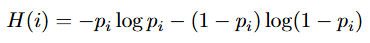
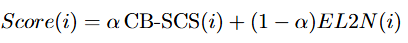
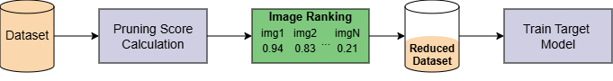

# Dataset Pruning for Semantic Segmentation using MedSAM

Deep learning models for medical semantic segmentation have wide applications to identify different kinds of lesions. However, building those models require large amounts of annotated data and substantial computational resources to achieve competitive results. These drawbacks have been tackled in other computer vision tasks, such as image classification, by developing dataset pruning methods.

Most existing pruning methods rely on intermediate models trained on the full dataset to estimate sample importance. Although effective, this requirement introduces a significant computational overhead that can offset the benefits of pruning. Furthermore, dataset pruning approaches specifically designed for semantic segmentation remain relatively scarce 

To address these limitations, we propose a novel dataset pruning pipeline for medical semantic segmentation that leverages the foundation model MedSAM to generate pseudo-masks and estimate sample relevance without requiring full model training. By exploiting the capabilities of a pretrained segmentation model, our approach substantially reduces the preprocessing cost associated with traditional pruning methods while maintaining—and in some cases improving—segmentation performance.

This repository provides the official implementation of the proposed framework, including several pruning strategies adapted to semantic segmentation tasks.

## Adapting existing pruning ranking methods

Based on the method proposed by Dai et al. in the paper [Training-free dataset pruning for instance segmentation](https://proceedings.iclr.cc/paper_files/paper/2025/file/4a5a9f5c15632e9f52c9c1ba4134f13c-Paper-Conference.pdf) for adapting classification-oriented pruning methods to instance segmentation, we slightly modify this procedure for semantic segmentation. We first compute an instance-level score by averaging the pixel-wise scores within each instance, obtained through classical pruning methods using per-pixel logits. Finally, the image-level importance score is obtained by summing the instance-level scores across all instances present in the image. The adapted pruning methods included in this repository are:

* **EL2N**: This method estimates sample difficulty by quantifying the relative error between the ground-truth and the early predictions of an intermediate model.
* **Entropy**: This criterion measures the uncertainty of each sample based on an intermediate model's predicted probabilities. In our binary setting,
let pi = P (yi = 1 | xi) denote the predicted probability of the positive
class for sample i. The entropy-based importance is then defined as:

    <p align="center">
    
    </p>

    This criterion can be extended to semantic segmentation by computing
    the entropy pixel-wise, using the model’s logits mask.

* **Forgetting**: This baseline relies on *forgetting events* to identify samples that are repeatedly forgotten during training, under the assumption that such samples are more informative. A *forgetting event* is defined as a training iteration in which a sample transitions from being correctly classified to incorrectly classified. When applying Forgetting as a pruning strategy using MedSAM, we emulate epoch-wise performance degradation through Test-Time Augmentations (TTA).

* **Intersection over Union (IoU)**: Although this metric is traditionally used to evaluate the performance of segmentation models, we use it as a proxy for sample difficulty based on the predictions of an intermediate model. Samples with lower IoU scores are considered more challenging to segment and, therefore, more informative than those with higher IoU values.

* **Class-Balanced Shape Complexity Score (CB-SCS)**: This cri-
terion measures the structural complexity of the object(s) present in an
image using only the ground-truth annotations. The score is computed
using the perimeter and area of the annotated object(s).

* **CB-SCS and EL2N combination (Fusion)**: This novel metric proposed in this wowkr aims to address the limitation of traiditional methods, which tend to rely exclusively on either geometric properties of the annotations or prediction probabilities derived from intermediate models. To this end, we integrate complementary information from both perspectives by combining CB-SCS which captures geometric and structural characteristics, and EL2N, which reflects model-based prediction difficulty. After normalization, they are fused into a unified score through a weighting parameter $\alpha$ $\in [0,1]$ which controls the relative contribution of both components.

    <p align="center">
    
    </p>

## Pipeline overview

The traditional dataset pruning workflow for semantic segmentation is illustrated below.

<p align="center">
    
    </p>

The objective is to reduce the amount of training data by systematically removing a subset of samples, thereby decreasing training and computational costs while maintaining the performance of the final model. To achieve this, an image-level pruning score is computed for each sample using a predefined criterion. Once all samples have been assigned a score, they are ranked accordingly and a reduced subset is selected to train the final model. Some approaches prioritize the most challenging samples, whereas others retrain a mixture of easy and difficult examples to preserve diversity. Finally, the target model is trained with the reduced subset. 

## Usage

After installing the library, dataset pruning can be performed directly from the command line. Two main commands are available:

### Downloading datasets

The `download` command automatically downloads and prepares the supported datasets (BUSI and MMOTU):

```bash
python main.py download \
    --dataset BUSI \
    --data-dir ./data
```

### Pruning a dataset

The `prune` command generates a reduced training subset according to a selected pruning strategy:

```bash
python main.py prune \
    --dataset-path ./data/BUSI \
    --output-path ./pruned_dataset \
    --pruning-model medsam \
    --pruning-rate 0.5 \
    --strategy el2n \
    --selection hard \
    --batch-size 8
```

#### Required arguments

| Argument         | Description                                                                                          |
| ---------------- | ---------------------------------------------------------------------------------------------------- |
| `--dataset-path` | Path to the dataset directory. It must contain `images` and `labels` subdirectories.                 |
| `--output-path`  | Directory where the pruned dataset and intermediate results will be stored (logits, rankings, etc).  |
| `--pruning-rate` | Fraction of samples to remove. Must be in the range `(0,1)`.                                         |
| `--strategy`     | Pruning strategy. Available options: `iou`, `cb-scs`, `el2n`, `entropy`, `forgetting`, and `fusion`. |
| `--selection`    | Sample selection policy: `easy`, `hard`, or `mixed`.                                                 |

#### Optional arguments

| Argument          | Description                                                                                                                  |
| ----------------- | ---------------------------------------------------------------------------------------------------------------------------- |
| `--pruning-model` | Model used to extract logits when required by the pruning strategy (`medsam` or `unet`).                                     |
| `--logits-path`   | Path to a precomputed logits file (`.h5`). If provided, logits extraction is skipped.                                        |
| `--batch-size`    | Batch size used during logits extraction.                                                                                    |
| `--seed`          | Random seed for reproducibility when using U-Net.                                                                            |
| `--epochs`        | Number of training epochs when using U-Net as the pruning model.                                                             |
| `--val-size`      | Validation split used when training U-Net. Must be in the range `[0,1]`.                                                     |
| `--alpha`         | Weight assigned to the CB-SCS score in the fusion strategy. Must be in the range `[0,1]`. Only valid when `strategy=fusion`. |

#### Important restrictions

* `pruning_rate` must be strictly between 0 and 1.
* `val_size` and `alpha` must be between 0 and 1.
* `alpha` can only be used when the pruning strategy is `fusion`.
* `epochs` and `val_size` are only used when `pruning_model=unet`.
* If `logits_path` is provided, the library will reuse the stored logits instead of recomputing them.

### Configuration file

Instead of specifying all parameters through the command line, the pruning pipeline can also be configured using a YAML file:

```bash
python main.py prune --config configs/pruning_config.yaml
```

The configuration file contains the same parameters available through the CLI. Any parameter explicitly provided through the command line overrides the corresponding value defined in the YAML file.

A template configuration file is provided in the repository and includes all supported options together with detailed descriptions of their expected values and constraints.


## Acknowledgements

This work is partially supported by Agencia de Desarrollo Económico de La Rioja [ADER 2022-I-IDI-00015], by the Government of La Rioja [Inicia 2023/01, Afianza 2024/01], and by Grant PID2024-155834NB-I00 funded by MICIU/AEI
/10.13039/501100011033 and by ERDF/EU.
